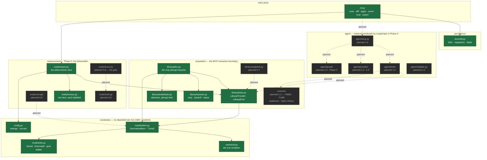
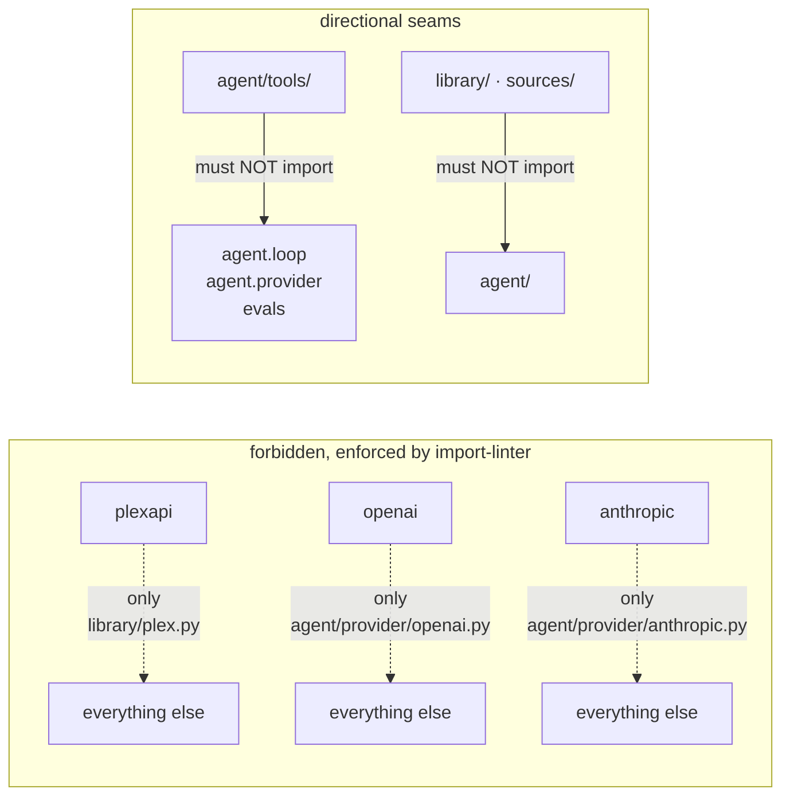
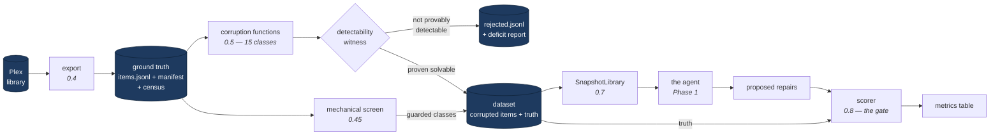
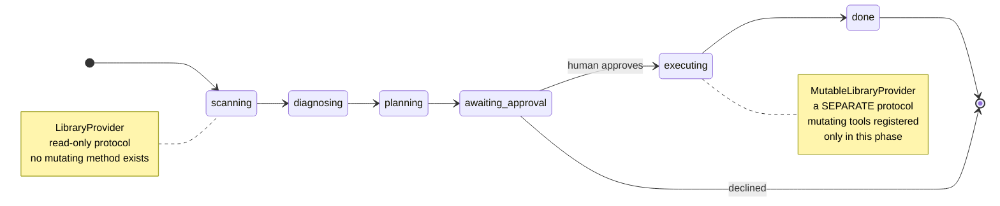
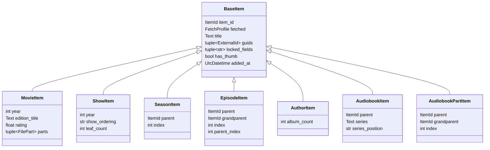
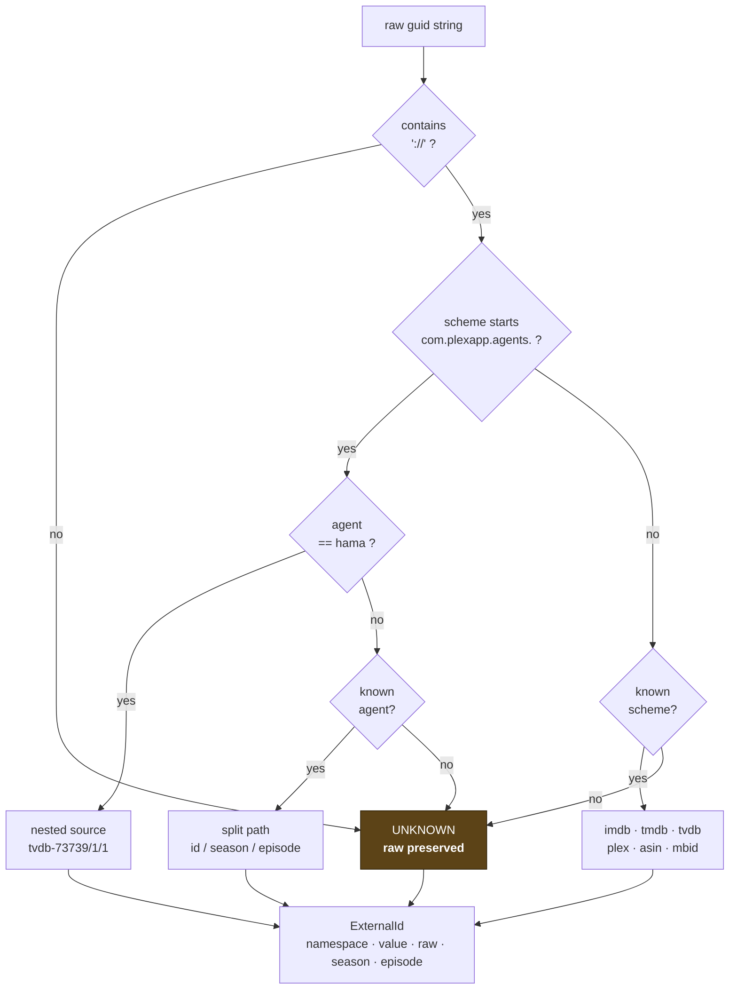
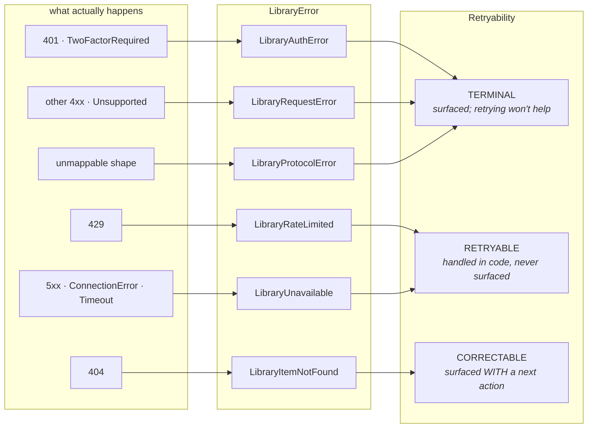
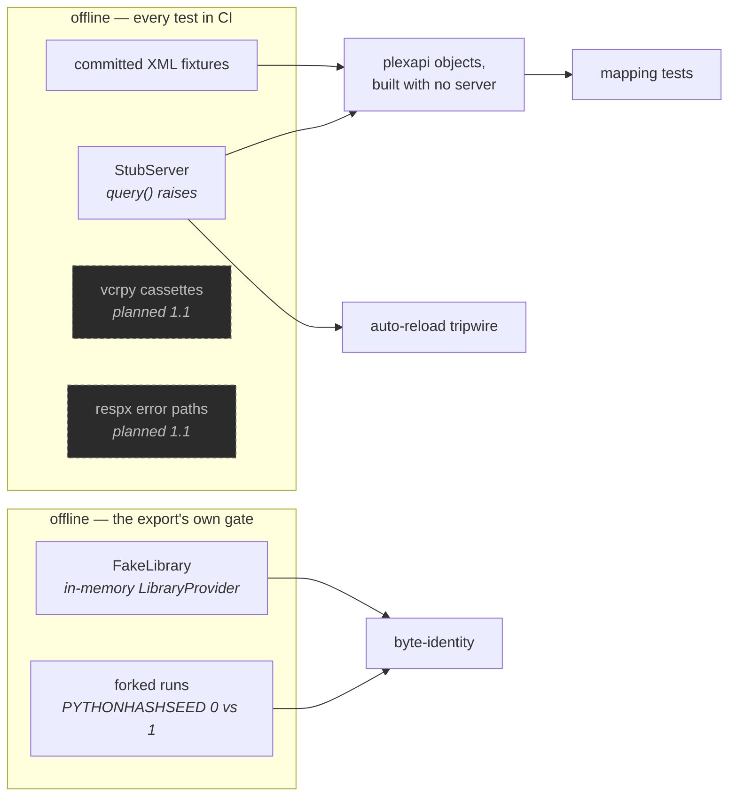

# ShelfWarden Architecture

How the system is put together, and why each seam is where it is.

This describes **what exists** (steps 0.1–0.3 are complete) and marks planned
structure as such. Where a decision has a recorded reason, this document points at
it rather than restating it: the spec is [`shelfwarden.md`](./shelfwarden.md), the
design detail is [`implementation-plan.md`](./implementation-plan.md), the verified
library traps are [`development-practices.md`](./development-practices.md), and the
per-step findings are in [`plans/`](./plans/).

---

## 1. The shape of the problem

ShelfWarden audits a Plex library, diagnoses metadata and organization problems,
proposes repairs, and — only after approval — applies them.

The hard part is not calling the Plex API. It is that **a language model's account
of what it did is not evidence that it did it.** A system that asks a model to find
mismatched movies will get back a confident list containing real findings,
plausible fabrications, and hallucinated citations, mixed in proportions nobody can
measure. So the architecture is organized around one question: *how would we know?*

Three structural answers, each of which shapes a whole layer:

| Question | Structural answer |
|---|---|
| How do we know the agent finds real problems? | Manufacture problems with known answers — the corruption harness — and score against ground truth |
| How do we know it cannot cause damage while diagnosing? | Mutating operations do not *exist* in the read phases; the type has no such method |
| How do we know a finding is grounded? | Every claim cites a stored evidence record, and a validator re-resolves the pointer in code |

---

## 2. The governing idea

From spec §3.1: **the model proposes, code disposes.** Any rule expressible as a
predicate lives in code — a type, a lint contract, a test — not in a prompt.

That principle is not decoration; it is why the module boundaries fall where they
do. Each invariant below has a *mechanism*, and the mechanism is the architecture.

| Invariant | Mechanism | Where |
|---|---|---|
| Scan and diagnose cannot mutate | `LibraryProvider` declares no mutating method; test asserts disjointness from `MUTATING_METHODS` | `library/base.py` |
| plexapi types never escape their adapter | import-linter contract, plus a runtime walk of returned values | `pyproject.toml`, `library/plex.py` |
| The tool layer is MCP-extractable | Contract: `agent/tools` may not import `agent.loop`, `agent.provider`, `evals` | `pyproject.toml` |
| Confidence is computed, not claimed | `Confidence{value, band, reasons}` derived in code; `model_confidence` recorded and gates nothing | *planned, 1.4* |
| Every mutation is reversible | `locked_fields` captured on every item from 0.2; snapshot-before-mutate | `models/item.py`, *planned, Phase 3* |
| Outcomes derive from recorded state | Scorer reads `postcondition` vs `ground_truth_item`, never the narrative | *planned, 0.8* |
| No silent caps | `Page` carries `total`/`returned`; `AudiobookVerdict` carries `sampled`/`population` | `models/item.py`, `library/audiobook.py` |
| Determinism | One canonical serializer; NFC text; UTC timestamps; sorted guids | `canonical.py`, `models/item.py` |

The recurring shape: **a claim in prose becomes a failure in CI.**

---

## 3. Package structure

Solid = built. Dashed = planned, with the roadmap step named.

Note the direction of every arrow: **the vocabulary layer depends on nothing.**
`canonical.py` and `models/ids.py` import only the standard library. That is what
lets the eval harness, the agent, and the providers all speak the same types
without any of them importing each other.

---

## 4. The enforcement seams

Five import contracts run in CI on every push. They exist because each protects a
claim the design makes, and a claim nobody checks is a claim that quietly stops
being true.

| Contract | Protects |
|---|---|
| plexapi confined to its adapter | "plexapi types never escape" — so `SnapshotLibrary` can substitute cleanly |
| OpenAI / Anthropic SDKs confined | Provider types do not spread; swapping providers stays a config change |
| `agent/tools/` cannot import loop, provider, or evals | The Phase 5 MCP extraction boundary — and a tool that could import `evals` could read the answer key |
| `library/` and `sources/` cannot import `agent/` | The same MCP boundary, in the other direction |

Two things learned the hard way, both recorded in
[`development-practices.md`](./development-practices.md) §1.3: an `ignore_imports`
line that matches nothing **fails the build**, and for an *external* package one
bare line is all that matches, because grimp collapses the package to a single
node. The contracts therefore carry no ignore lines until the import they describe
actually exists — which means CI breaks at exactly the step that introduces a seam.
That is the contract working, not failing.

---

## 5. The measurement loop

This is Phase 0, and it is the most important thing in the repository. Everything
downstream is measured against it.

Three properties make this more than a test fixture:

**The agent cannot tell which world it is in.** `SnapshotLibrary` implements the
same `LibraryProvider` protocol and raises the same `LibraryError` taxonomy as
`PlexLibrary`. Because normalization happens at the edge, the snapshot has nothing
to fake — it serves the same dataclasses from JSON.

**No case ships without a detectability witness.** A corruption that nulls a
summary which was already empty, or renames a film TMDB has no alternate title
for, produces a case no agent could solve. Left to scoring time these depress the
pass rate and hide real regressions. The generator runs *the scorer's own
comparator* over the witness and rejects cases that fail, into a per-class deficit
report — so "TMDB has no alternate title for 40% of this library" surfaces as a
coverage gap rather than a mysteriously low score.

**Reversibility is a property test.** `apply_reverse(changes)` on a corrupted item
must equal the ground-truth item byte-for-byte under the canonical serializer. This
is why `NormalizedItem` is frozen and why `with_changes` is the only mutation path:
a corruption that mutated in place could lose its own audit trail.

### The export, and the two things it refuses to do

The export is the step that turns a live, mutable, network-dependent server into a
file that does not change. It writes one directory — `items.jsonl`, `manifest.json`,
`census.json`, `census.md` — built in a temp directory and moved into place with a
single `os.replace`, so an interrupted run leaves nothing rather than something
plausible.

Two refusals shape it more than any feature does.

**It will not half-write a family.** The unit of selection is a root plus every
descendant: show → seasons → episodes, author → audiobooks → parts. `--count`
counts *roots*, and a family that would push past `--max-records` is dropped whole
and recorded in `manifest.dropped`, never truncated. A show missing its last four
episodes is an unsolvable case for `episode_wrong_season` and a mysteriously
depressed score in 0.8 — the same failure the detectability witness exists to
prevent, arriving one step earlier.

**It will not write a partial export that looks complete.** A member that vanishes
mid-walk drops its family, with the reason recorded. An unsupported section is
skipped with the audiobook verdict's own explanation attached, so the refusal can
be argued with. But a `LibraryUnavailable` that survives the session's retries
aborts the whole run and writes nothing at all.

The census is deliberately **two tiers with two bases**, because conflating them
makes the numbers unfalsifiable. Population is exact, from the listing walk. The
slice tier — guid namespaces, containers, lock state — comes from records actually
fetched and carries `coverage: {records, population}` on every block. Its
`readiness` table counts *structural candidates* for each problem class and is
flagged `advisory: true` on every row: it does not verify that any item is free of
a problem. That is the mechanical screen in 0.45, and reading a readiness count as
a `no_action` label would make the should-not-touch slice unfalsifiable.

---

## 6. The read/write seam

Spec §3.2 requires that mutating tools *not exist* outside the `executing` phase —
not "are not called", do not exist. plexapi offers no read-only mode: every method
on it is an HTTP call the server accepts based on token permissions. So the
guarantee cannot live in the client library. It lives in two places.

**First, the type.** `LibraryProvider` declares six methods — `sections`,
`list_items`, `get_item`, `get_children`, `get_files`, `find_similar` — and no
`edit`, `merge`, `fixMatch`, `refresh`, or `delete`. A test asserts the protocol's
method set is disjoint from a declared `MUTATING_METHODS` set, and a second test
asserts the six reads are still present, so the first cannot pass by the protocol
being empty. Phase 3 adds `MutableLibraryProvider` as a *separate* protocol; it
does not extend this one.

**Second, the registry.** The tool registry is keyed by `RunPhase`, and mutating
tools are registered only under `executing`. `agent/tools/mutating.py` is never
imported by the read-only registry.

---

## 7. The normalized model

Frozen Pydantic models with `extra="forbid"`, discriminated on `media_kind`.
`ItemId` and `ExternalId` are frozen dataclasses — internal value objects wanting
hashability rather than validation.

Three design choices carry more weight than they look:

**`FetchProfile` travels with every record** — `STUB`, `CORE`, or `FULL`. plexapi
reloads a partial object only when an attribute is `None` or `[]`, and with
auto-reload disabled it does not, so a list-fetched item reports `guids == ()`
whether it has no external ids or nobody asked for them. The same type flows out of
the export at `FULL` and out of `get_item_details` at `CORE`. Without the marker,
"absent" and "unfetched" are the same value.

**`author` is a seventh kind**, beyond the roadmap's original six. Two audiobook
corruptions address the Plex Artist — `author_name_variant` records "the id set to
merge" — which is unrepresentable unless authors have `ItemId`s. Author → Audiobook
→ Part then mirrors Show → Season → Episode exactly.

**Artwork is a presence boolean, not a URL.** A thumb key ends in a mutable
timestamp; the only corruption touching artwork cares whether artwork exists.

---

## 8. Identity, and the guid ladder

Plex identifies items two incompatible ways depending on which metadata agent
matched them, and a legacy-agent library is exactly where wrong-match problems
concentrate. plexapi does no parsing at all — `media.Guid` exposes `id` as a bare
string — so this ladder is the entire specification of what the project understands.

**Nothing is ever dropped.** An unrecognised guid becomes `UNKNOWN` with its raw
string intact, and the 0.4 census counts guids by namespace *including unknowns
with examples*. That converts an unverifiable assumption — which legacy forms
actually exist in the wild — into a measurement the real library reports.

`ItemId` is a composite `(provider, section_id, rating_key)`, never a bare key, so
snapshot and live ids cannot collide. It is an **address, not an identity**: Plex
rating keys move on rescan, which is why eval `case_id` is semantic and derived
from external id → normalized title+year → path hash instead.

---

## 9. Errors are a taxonomy, not a grab bag

CLAUDE.md requires every error be classified as retryable, correctable, or
terminal — and a correctable error that does not name a next action is a bug,
because tool error messages are prompts.

The translation is harder than it looks, for a reason worth knowing:
**`PlexServer.query` maps 401 to `Unauthorized`, 404 to `NotFound`, and everything
else — 429, 500, 502, 503 alike — to `BadRequest`.** Retryable and terminal
conditions are indistinguishable by exception type; the status survives only inside
the message string. So `library/session.py` supplies our own `requests.Session`
with a response hook that records the status as an integer, and message parsing
stays only as a fallback.

`LibraryItemNotFound` is *correctable* rather than terminal because it is usually
recoverable — rating keys move on rescan — and it carries a next action saying so.
`LibraryError.__init__` refuses to construct a correctable error without one, so no
raise site can forget.

---

## 10. Persistence

SQLite, no ORM. WAL mode, explicit `autocommit=False`, `PRAGMA foreign_keys=ON` on
every connection, and a checksum-verified migration runner that refuses to run if an
already-applied migration file has changed.

The content-addressed `blobs` table is the substrate for the rest: assembled
contexts, **raw model responses stored verbatim**, tool results, and evidence
bodies, all keyed by SHA-256 and referenced by hash. Storing responses verbatim is
what makes Phase 2's deterministic replay a configuration change rather than a
rewrite — and it deduplicates the system prompt that otherwise repeats across every
step of every run.

---

## 11. What makes the bytes stable

Determinism is not a nice property here; the export's own test is that re-running
it against an unchanged library is byte-identical, and content-addressed evidence
and semantic case ids both reduce to hashing. Seven things had to be pinned, each
because it was verified to change the bytes:

| Hazard | Resolution |
|---|---|
| `json.dumps` emits bare `NaN`/`Infinity` — not valid JSON | `allow_nan=False`; fail at write time |
| NFC vs NFD render identically, hash differently | Text normalized to NFC at the model boundary — **paths deliberately exempt**, since Phase 3 renames real files and macOS hands out NFD |
| `8` and `8.0` serialize differently | Field types pinned in the model, not inferred |
| Datetimes serialize by representation, not instant | Coerced to aware UTC; naive values rejected |
| plexapi returns guids in XML order | Sorted at construction; stored as tuples |
| `Counter.most_common()` and `set` iteration order are hash-seed dependent | Every aggregation sorted by an explicit total order — count descending, then key ascending — and the determinism test forks with `PYTHONHASHSEED` 0 and 1, since one process cannot see this at all |
| `canonical_json` sorts mapping keys, so a count-ordered dict does not survive the round trip | Ordering a human reads is re-derived when `census.md` is rendered, never inherited from the stored dict |

The plexapi layer contributed two more, both of which **fail open** — the library's
config helpers prefer a permissive default to an error:

- **Auto-reload** accepts only lowercase `"false"`/`"0"`; `"False"` is swallowed by
  a bare `except:` and returns the permissive default, silently leaving every
  partial object refetching over the network.
- **`setDatetimeTimezone("utc")`** turns a `ZoneInfoNotFoundError` into
  `tzinfo = None` behind a log warning nobody sees, restoring naive local-time
  timestamps on a host without that tzdata entry. It passed locally and failed in
  CI.

The lesson generalized into `development-practices.md` §4.3: **assert the property
you need, not the call you made.** `PlexLibrary` sets both values itself and then
verifies them — on the config, and again on a fetched object.

---

## 12. Testing topology

No test touches the network, and none needs a live Plex server. plexapi objects
build from committed XML with a stub server whose `query()` raises — which makes
that stub the **auto-reload tripwire** as well as a fixture harness: touching a
`None` attribute on a partial object is exactly what triggers the silent refetch,
so the guarantee is provable in CI. A companion test asserts the tripwire *does*
fire when auto-reload is on, so the guarantee cannot pass for the wrong reason.

Static and dynamic confinement checks catch different mistakes: `lint-imports`
proves no *module* imports plexapi; a runtime walk over returned values proves no
plexapi *object* escapes through a return.

The export's gate needs a second fixture of its own. `FakeLibrary` implements
`LibraryProvider` and nothing else, which is the point: if the export ever reaches
for something only `PlexLibrary` has, those tests stop importing rather than
quietly binding the export to the adapter — the runtime companion to the
`evals` → `library.plex` import contract. And byte-identity is asserted twice,
once in-process and once across two forked runs with different `PYTHONHASHSEED`
values, because a single-process comparison cannot see hash-order leakage at all.

---

## 13. Current state

| Step | Status | What landed |
|---|---|---|
| 0.1 Scaffold | ✅ | 5 import contracts, CI, package skeleton, migration runner |
| 0.2 Normalized model | ✅ | 7 media kinds, guid ladder, canonical serializer |
| 0.3 Read-only provider | ✅ | `LibraryProvider`, `PlexLibrary`, session, audiobook detection |
| 0.4 Export + census | ✅ | Deterministic `items.jsonl` + manifest, lock state, part ids, two-tier census incl. unknown guids, `provider_info()`, 6th import contract |
| 0.45 Comparators + screen | ⬜ | Shared comparator library; LLM-free verification |
| 0.5 Corruption functions | ⬜ | 15 problem classes, each with a detectability witness |
| 0.6 Truth schema + generator | ⬜ | Semantic case ids, composition config |
| 0.7 SnapshotLibrary | ⬜ | Same protocol, same taxonomy |
| 0.8 Scorer | ⬜ | **Phase 0 gate** |
| Phase 1 | ⬜ | Sources, provider interface, tools, validator, loop, eval runner |
| Phase 2–5 | ⬜ | Guard chain, replay, repair stage, LangGraph, MCP + Temporal |

3,909 lines of source, 3,398 of tests, 393 tests, all offline.

**Phases are gated.** Do not begin one until the previous gate is met — the gate
text is in [`roadmap.md`](./roadmap.md).

---

## 14. Where decisions are recorded

| Kind of decision | Lives in |
|---|---|
| Settled architecture, not to be relitigated | `shelfwarden.md` §3 |
| Design detail, schemas, build steps | `implementation-plan.md` |
| Verified library traps and stack conventions | `development-practices.md` |
| Per-step findings, decisions, and their reasoning | `plans/step-*.md` |
| Progress and gate state | `roadmap.md` |

Corrections belong with the reasoning, not in a commit message alone. Several
already exist: `search_audnexus` cannot be built as specified because Audnexus has
no book-search endpoint; Plex has no audiobook library type; plexapi has no
read-only mode; the media-kind list needed a seventh entry. Each was recorded where
the next reader will hit it.
